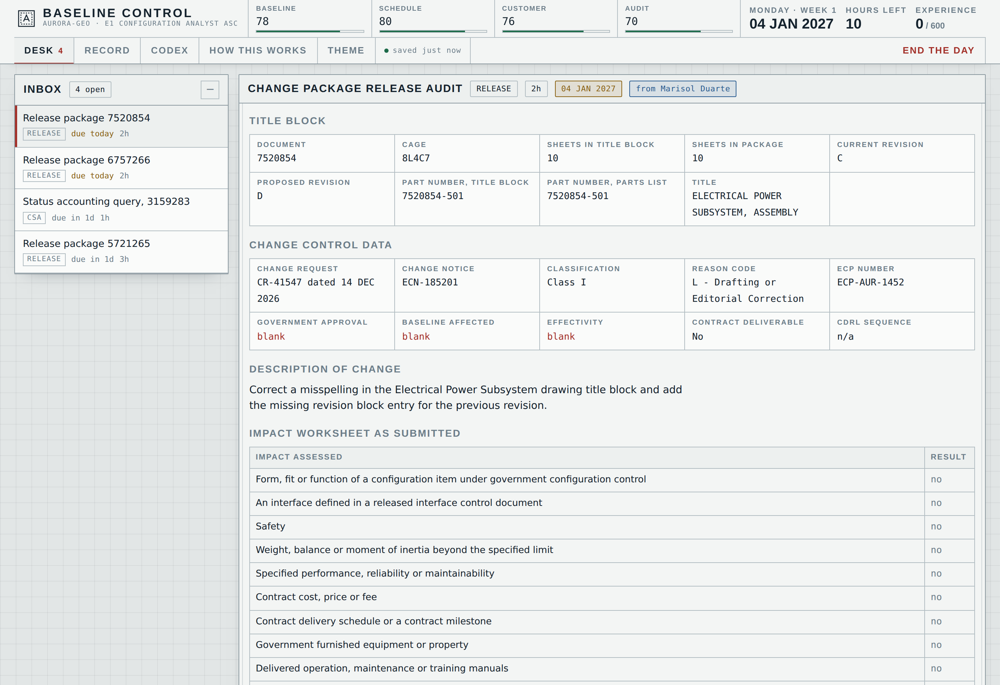
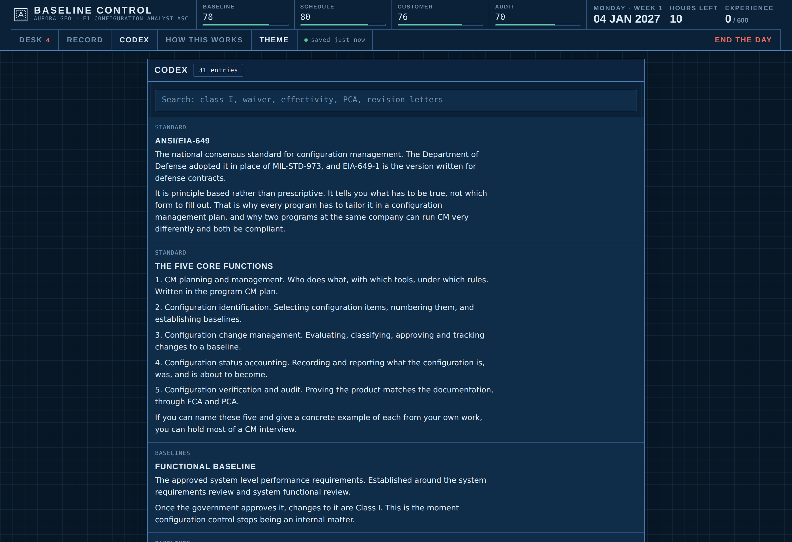

# Baseline Control

A configuration and data management simulator. You are a configuration analyst at a
fictional defense contractor. Change packages arrive faster than you can read them,
the change control board meets Wednesday, and the vault will accept whatever you
release, forever.

Every scenario is generated, so it does not run out. The company, the programs, the
people and the suppliers are invented. The standards and the vocabulary are real:
ANSI and SAE EIA-649, Class I and Class II changes, form fit and function, CDRL and
SDRL, FCA and PCA, functional, allocated and product baselines.

Vanilla JavaScript. No framework, no build step to run it, no runtime dependencies.



The page has two themes, taken from the two ways an engineering drawing gets
reproduced: a whiteprint on cool paper, and a cyanotype blueprint.



---

## Running it

Clone it and open `index.html`. That is the whole thing.

For the service worker and offline support you need it served over http:

```bash
npm start          # http://localhost:8080, zero dependency static server
```

Other scripts:

```bash
npm test           # the full suite, about 10 seconds
npm run test:quick # a smaller sample, about 3 seconds
npm run build      # single file bundles into build/, and _site/ for deployment
npm run icons      # regenerate the manifest PNGs from icons/icon.svg (needs playwright)
```

`npm run build` produces two bundles:

- `build/baseline-control.html` is a complete standalone document. One file, open it
  anywhere, works offline with no server.
- `build/artifact.html` is the same page without the document skeleton, for hosts that
  supply their own.

---

## What you actually do

Ten task types, all generated, each graded against a derived answer key rather than a
lookup table.

| Task | What it drills |
|---|---|
| Change package release audit | Find the discrepancies in a package, then release, release with comments, or return it |
| Engineering change classification | Class I or Class II against an impact worksheet, plus priority and routing |
| Interchangeability | Revise in place, or a new part number, or one way interchangeability |
| Variance | Deviation, waiver, engineering change, or rework to the drawing |
| CDRL and SDRL review | Compliance against the data item description, the due date, markings and the review window |
| Change control board | Disposition each item against what the room actually said |
| Configuration status accounting | Trace a serial number's configuration through effectivity and dates |
| FCA and PCA | Call each audit line, including the ones that belong to the other audit |
| Baseline gates | Which baseline is set where, and who controls it |
| Situations and escapes | Judgement calls, and the ones you got wrong coming back later |

Career mode runs a four by ten week, Monday through Thursday, ten hours a day. Four
meters track baseline integrity, schedule health, customer confidence and audit
readiness. Experience accumulates until a panel convenes and asks four questions.
Three right and you move up a tier, which unlocks new work: classification at E2,
audits and plans at E3, architecture at E4, policy at E5.

Drill mode has no clock and no consequences. Pick a tier, narrow to one kind of task
if you like, and answer until you stop.

An in-app codex covers the standards and the vocabulary, and opens mid task. Using it
is not cheating.

---

## How the generation works

Every scenario is built from a seeded generator with the answer derived from the
same data the player is shown. Nothing is random-graded.

The release audit is the clearest example. A clean, internally consistent change
package is built first: revision sequence, signature block sized to the disciplines
the change actually touches, effectivity that avoids delivered units, classification
that matches the impact worksheet, related documents that include the interface
control document when an interface moved. Then zero to five discrepancies are injected
from a catalog of twenty one, with conflict groups so two discrepancies never make
each other ambiguous. The candidate findings offered to the player are the injected
ones plus distractors drawn only from the pool that is provably absent, and anything
sharing a conflict group with an injected discrepancy is withheld so a distractor is
never arguably true.

Classification runs off a change catalog of thirty two templates, each carrying the
impact flags that decide its class. About a third are deliberate traps in both
directions: a surface finish change that looks cosmetic and is not, a forty gram
addition that looks major and is not.

Status accounting builds a change notice history laid out backwards from today, so
nothing in the register is ever dated in the future, and the answer is computed by the
same rule the player is expected to apply.

---

## Saving

Progress is written to browser storage after every item, at the end of each day, on
promotion, and when the tab goes away. Answers you are part way through on the current
item are saved too, so a reload puts your ticked findings back.

- **Five slots.** Careers on different programs coexist. Name them, delete them,
  switch between them.
- **A versioned format.** Saves carry a format number and a migration path, so an
  update does not throw away a career in progress. A save from a newer build is
  reported rather than silently mangled.
- **Export and import.** Browser storage belongs to one browser on one device, so a
  career can be exported as JSON and imported anywhere. Where the host allows
  downloads it is a file. Where it does not, the same text is shown to copy.
- **Honest failure.** If storage is blocked, a banner says so rather than pretending
  to save.

Storage keys all live under the `bc.` prefix.

---

## Layout

```
index.html                 loads src/*.js in order, ordinary scripts, no modules
src/style.css              the whole stylesheet
src/03-core.js             seeded RNG, calendar, revision letters, catalogs
src/04-world.js            program, configuration items, units, suppliers
src/05-changes.js          the change catalog and the Class I rule
src/06-release.js          release audit generator, discrepancy injection, grading
src/07-tasks-a.js          classification, interchangeability, variance, CDRL
src/08-tasks-b.js          status accounting, audits, baseline gates, minutes
src/09-tasks-c.js          the board, situations, staff decisions
src/10-codex.js            the reference and the promotion question banks
src/11-store.js            slots, migration, export and import
src/12-engine.js           the working day, meters, escapes, promotions
src/13-ui-items.js         one renderer per task type
src/14-ui-core.js          shell, navigation, modals, interaction
src/15-boot-sw.js          service worker registration, http only
sw.js                      offline cache, stale while revalidate
tools/build.mjs            bundles and site assembly
tools/serve.mjs            local static server
test/                      the suite
```

Scripts are plain, not ES modules, so the page works when opened straight from disk.
Each file is an IIFE that hangs one object on `window`, which also makes the whole
thing trivially concatenable into a single file.

---

## Tests

```bash
npm test
```

Eighty checks in four suites:

- **grading** generates roughly fourteen thousand scenarios across every task type and
  every tier, answers each one from its own key, and requires a perfect score every
  time. It also checks that every injected discrepancy is visible in the data the
  player is shown, that every one is offered as a candidate finding, that no distractor
  is actually true, and that a deliberately wrong answer scores badly.
- **dates** checks that no change notice, approval, retrofit or contract date is ever
  in the future, and that the four by ten calendar holds for day numbers at or before
  day one.
- **career** plays sixty days perfectly and forty days badly, and checks the
  consequences land: promotions, escapes, meters moving in the right direction and
  staying in range, history staying trimmed, drill mode honoring its filters.
- **persistence** covers reload survival, slot isolation, migration of an old single
  slot save, export and import round trips, refusal of garbage and of newer formats,
  restoring a half finished answer, and running at all when storage is blocked.

---

## Deploying to GitHub Pages

The workflow in `.github/workflows/pages.yml` runs the tests, builds, and publishes
`_site` on every push to `main`.

1. Push the repo to GitHub.
2. Settings, then Pages, then set Source to **GitHub Actions**.
3. Push to `main`.

Paths are relative throughout, so it works under a project subpath such as
`username.github.io/baseline-control/`.

---

## Accuracy note

The standards, the terminology and the rules are real and are applied as written.
Data item description numbers follow the real `DI-XXXX-nnnnn` format and several are
drawn from real DIDs, but the specific numbers here should be treated as
representative rather than as a lookup table. Salary bands shown on the record screen
are the published ranges for the real role tiers this was modeled on.

Meridian Aerospace Systems and every program, person and supplier in it are fictional.

## License

MIT.
